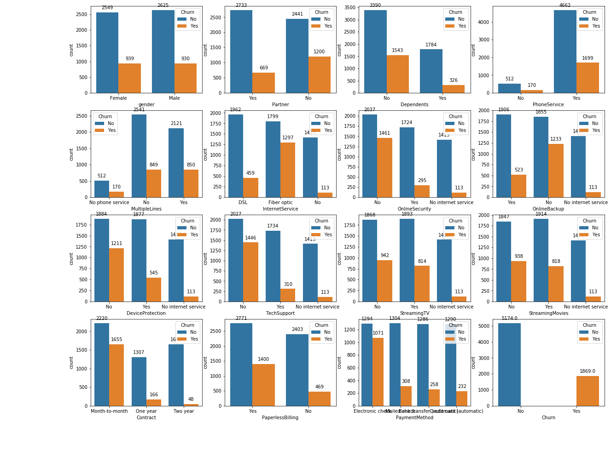
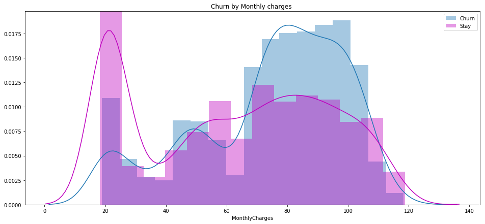
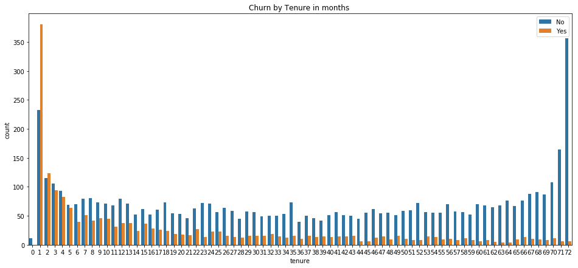
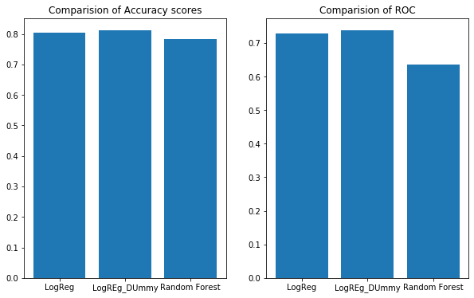
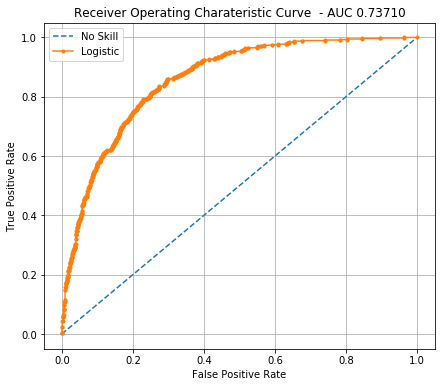
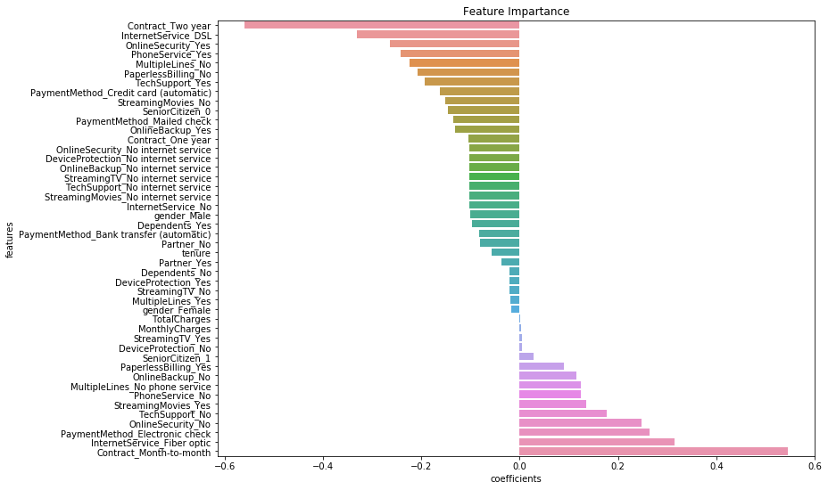

# So that's why Telecom customers jump tanks..

######                Monthly contract, only internet and Bill shock could be the doing the damage

###### **T**elecom industry is highly competitive. Retaining customer is challenge in itself. Understanding the factors behind customer behavior behind dumping one provider to avail competitors service, is key to retaining customers and to run the telecom services profitability.

###### So What are the primary cause for customer to leave..

## Month-to-Month payment contract doesn't work for TeleCOs
> ###### Yes, you read it right. Data reveals that when the customer avails month on month payment contract mode , he or she is __42%__ more likely to move to another service provider than a customer with yearly or two years contract.

## Only Fiber Optics Plan is not good enough
> ###### Next customers with Fiber for internet are mostly likely to leave, about __42%__ customers who use only fiber optics service are likely to churn out.

## Bill Payment through Electronic Check 
> ###### Customers who have opted to pay bills using electronic check clearly have very high churn rate of upto __45%__

## Longer the customers stays the better 
> ###### The data shows a general tendency of the longer a customers stays with the Telecom service they is more likely to stay even longer. Similarly the longer stay means more money the customer has paid to the company is more likely to stay. It is interesting to note that if the customer has spent more that __$8K__ with the telecom operator the chances of customer migrating is almost nil.

## Monthly Charges are from $70 to $100 .. 
> ###### Look out for such customers .. well they can be on their  way out.
> ###### There other factors which also shows high chances of leaving like, People who only use Internet without phone or other value added services like online backup or technical support.

###### _It boils down to a deadly combination that could be summaried as_

>> ###### _There is more than 70% of chance for a person using only Fiber optics internet service with month-on-month contract of __$70 - $100__ paying through Electronic Check leaving in a month._

###### The graph below shows the counts of subscribers who left versus who stayed against each feature. This give a broad picture of which feature contributes to higher churn rate.

## Tenure and Monthly Charges
> ###### The data speaks for itself.

###### Interestingly, gender, having dependents or partners does not seem to have a significant impact on the customer churn.

## What can be do to prevent customers leaving 

###### Luckily, there are machine learning model which can be build and trained to predict if the customer have a probability of leaving. This gives the Telecom companies an opportunity to proactively address any customer issue before it is too late. There are many ideas present in other article like [here](https://medium.com/@paldesk/what-is-customer-churn-how-to-reduce-it-402460e5b569) and data models describe in other [articles](https://medium.com/dataseries/how-to-predict-customer-churn-29b68ecab223) used to predict Telcom customer churn.

###### With the data and models I have used to predict the probability  of customer moving on, the Machine learning model using Logistic regression technique proves to be the best.

###### For those of are not aware of machine learning model or think it a machine with the intelligent of human being then [check out here](https://medium.com/@randylaosat/a-beginners-guide-to-machine-learning-dfadc19f6caf).

## The chosen Model
###### There are many other ML model which could perform better but, the models I have used are 
> ###### 1. Logistic regression using number encoding of feature
> ###### 2. Logistic regression using dummy variable encoding of feature.
>###### 3. Random Forrest Ensemble. 

###### The metrics of the models used are compared here where Logistic regression with dummy variable substitution technique has better model metrics and can be used for prediction on  new customers data

## Logistic Regression model scores

LogisticRegression(C=1.0, class_weight=None, dual=False, fit_intercept=True,
          intercept_scaling=1, max_iter=100, multi_class='ovr', n_jobs=1,
          penalty='l2', random_state=42, solver='liblinear', tol=0.0001,
          verbose=0, warm_start=False)

Classification report for dataset with Dummy variable replacement: 
              precision    recall  f1-score   support

          0       0.85      0.90      0.87      1539
          1       0.68      0.57      0.62       574

avg / total       0.80      0.81      0.81      2113

Accuracy   Score :  __0.811168954094__
Area under curve :  __0.737099071074__

###### Hope this was useful. Thanks for your time.
